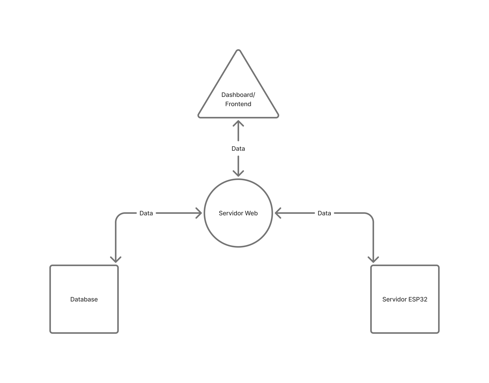

# Irrigação SESC – Automação com RTC DS3231 e ESP32

Este projeto tem como objetivo automatizar o sistema de irrigação de uma horta utilizando o microcontrolador **Arduino** e o módulo de relógio de tempo real **DS3231**. O sistema ativa uma válvula (simulada com um LED) todos os dias em um horário programado, por um período definido, sem a necessidade de intervenção manual.

## Estrutura do Projeto

## Funcionalidades

- 🌞 Ativação automática diária em horário programado (ex: 16h50)
- ⏱️ Temporização precisa com uso de RTC DS3231
- 💡 Simulação da válvula de irrigação com LED
- 🔁 Reagendamento automático do alarme para o dia seguinte
- ⚙️ Suporte a interrupções com o pino SQW do RTC

##  Componentes Utilizados

- Arduino Uno (ou compatível)
- Módulo RTC DS3231
- LED (simulação da válvula)
- Resistor 220Ω
- Jumpers e protoboard
- (Opcional) Relé 5V para acionamento real da válvula

## Conexões

| Componente     | Pino Arduino |
|----------------|--------------|
| DS3231 SDA     | A4           |
| DS3231 SCL     | A5           |
| DS3231 SQW     | D2           |
| LED + Resistor | D3           |

>  **Importante**: o módulo DS3231 deve estar com bateria (CR2032) para manter a hora mesmo com o Arduino desligado.

## Como Usar

1. Instale a biblioteca [`RTClib`](https://github.com/adafruit/RTClib) no Arduino IDE.
2. Conecte os componentes conforme a tabela acima.
3. Faça upload do código `main.ino` para sua placa.
4. O sistema agendará o alarme para o horário programado e repetirá diariamente.

## Arquitetura Sistema Web:

## Framework:
Nesse projeto web sera utilizado a framework React.js para o  front-end e Node.js para o back-end.

## Questoes em aberto:
- Qual melhor servidor para nosso contexto?
- Qual protocolo  utilizar? MQTT.
- Qual framework? 
  - Front: react.js
  - Backend: node.js
- Servidor Web e banco de dados podem estar no mesmo componente fisico?
- Banco de Dados? Postgress - relacional.

## TODO:

1. Configurar e desenvolver servidor nativo do ESP para armazenamento temporario dos dados e comunicacao com o servido web. Alem de implementar rotas e integrar freeRTOs ao codigo desenvolvido.
2. Implementar a pagina web e decidir as ferramentas utilizadas. Integrar codigo do RTC ao codigo do servidor, bem como implementar codigo de leitura dos demais sensores.
3. Configurar e desenvolver a base de dados.
4. Configurar e desenvolver o servidor web.

## Licença

Este projeto está licenciado sob a [MIT License](LICENSE).

